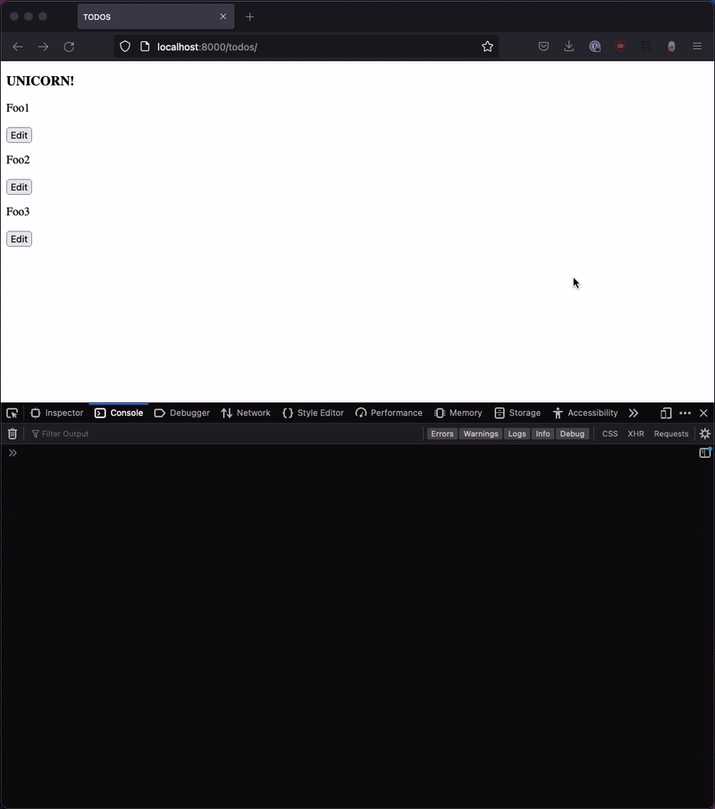

## Setup repo

* Clone repo and poetry install
* ./manage.py makemigrations && ./manage.py migrate
* ./mange.py shell 
  * Create some sample todos: 
```python 
from example import models
models.Todo.objects.create(title="foo")
models.Todo.objects.create(title="foo2")
models.Todo.objects.create(title="foo3")
```
* Run ./manage.py runserver
* Navigate to localhost:8000/todos/
* Edit 1 item, no error
* Edit another item and get the following error: `Uncaught TypeError: component.actionEvents[eventType] is undefined`

### Gif Example
